<!--

  # COM
  - Faire un helper imprimable sur piano
  - Bel exemple réel en gif

  # VISUAL LANGUAGE
  # - définir chaque entité et stabiliser en fonction

  # PYINSTALLER OSX AND LINUX PACKAGE
  # - refaire le systeme de propagation de config ?
  # - Develop l'interface Ncurse
  # - Permettre l'utilisation sur clavier d'ordi

  # FINIR MAIN

  # --with-config :  lance le programme suivant le config à lemplacement donné


# OPTIONAL

    # GENERIC STUFF
    # Rendre le fire generic à color et speed ?
    # Faire un meteor ?

 -->


<p align="center">
  <a href="https://github.com/tfrere/music-2-led" title="haxe.org"></a>
</p>

<p align="center">
	<a href="https://github.com/tfrere/music-2-led#licence"></a>
	<a href="https://github.com/tfrere/music-2-led"></a>

  <a href="https://github.com/tfrere/music-2-led"></a>
<a href="https://github.com/tfrere/music-2-led"></a>
</p>

#

**Music 2 Led** is an open source program that allows you to create **real-time audio and midi visualizations on led strips** using Arduino and Python. It was designed for **DJ**'s or **music groups** that want to add some **automated lighting effects** to their shows without big budget.

All you need is a **computer**, an **arduino** and a **led strip**.

### Showcase

...

### How it works ?

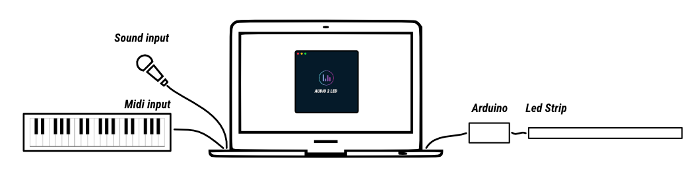

### What do i need to do to use it ?

1. [Install the program](#python-program)
2. [Build an arduino case](#arduino-part)
3. [Update the CONFIG.yml](#configuration)
4. [Setup your show with the effects and mods documentation](#effects---modes)
5. Enjoy !


# Table of contents
- [Installation](#installation)
  * [Python part](#python-part)
  * [Arduino part](#arduino-part)
- [Configuration](#configuration)
  * [Audio channels](#audio-channels)
    + [Virtual Audio Source](#virtual-audio-source)
      - [Linux](#linux)
      - [OSX](#osx)
  * [Midi channels](#midi-channels)
    + [Virtual MIDI ports](#virtual-midi-ports)
  * [CONFIG.yml](#configyml)
    + [Sample config file](#sample-config-file)
- [Effects & Modes](#effects---modes)
  * [Effects](#effects)
    + [Sound based](#sound-based)
    + [Midi based](#midi-based)
    + [Time based](#time-based)
    + [Generic](#generic)
  * [Modes](#modes)
- [Credits](#credits)
- [Contribute](#contribute)
- [License](#license)


# Installation

## Python part

The binary file is [here(DEADLINK)](/toto)

```
./music2led --help

-h, --help            show this help message and exit
-l, --list-devices    list available devices
--test-audio-device TEST_AUDIO_DEVICE
                      Test a given audio port.
--test-midi-device TEST_MIDI_DEVICE
                      Test a given midi port.
--test-serial-device TEST_SERIAL_DEVICE
                      Test a given serial port. This will test your arduino / led installation by
                      displaying three ( red green bue ) pixels and make them roll on the strip.
--test-config-file TEST_CONFIG_FILE
                      Test a given config file.
--single-strip SINGLE_STRIP
                      Launch the first strip without gui and multiprocessing.
                      It's for testing purpose.
--with-config-file WITH_CONFIG_FILE
                      Launch with spectific config file. Default one is
                      CONFIG.yml just near the executable.
```

## Arduino part

As each led project has very specific needs, i kept this part as simple as possible.

In case you need a complete packaged product, there is a more advanced version available in the [Arduino folder](/arduino/). You will find 3d printed arduino cases and a more complete electronic scheme.

The arduino code is [here](arduino/serial-case/serial-case.ino).

PS : For now, please consider not using more than 254 leds by arduino.

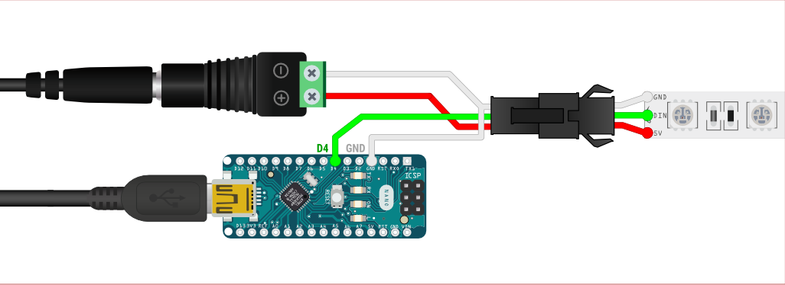

# Configuration

This program will use Audio ports, Midi ports and Serial ports.

To help you to configure your CONFIG.yml correctly, there is a little helper that
will list all available ports for each of them.

```
./music2led --list-available-devices
```

## Audio channels

This program streams audio from the default audio input device (set by the operating system).

Examples of typical audio sources:
- Audio cable connected to the audio input jack (requires USB sound card on Raspberry Pi)
- Webcam microphone, headset, studio recording microphone, etc

On OSX you have the "Built-In Microphone" as a default choice.

<!-- You can make some tests with a tone generator and the spectrum mode
https://www.szynalski.com/tone-generator/ -->

### Virtual Audio Source
You can use a "virtual audio device" to transfer audio playback from one application to another. This means that you can play music on your computer and connect the playback directly into the program.

#### Linux
Linux users can use [Jack Audio](http://jackaudio.org/) to create a virtual audio device.

#### OSX
On OSX, [Loopback](https://www.rogueamoeba.com/loopback/) can be use to create a virtual audio device.

## Midi channels

For the MIDI part, it's pretty simple, just plug-in your MIDI devices and run the following command to check if it's detected.

```
./music2led --list-available-devices
```

### Virtual MIDI ports

On OSX, it's pretty easy to make some virtual MIDI ports.
Here is an example for using them with ableton live.

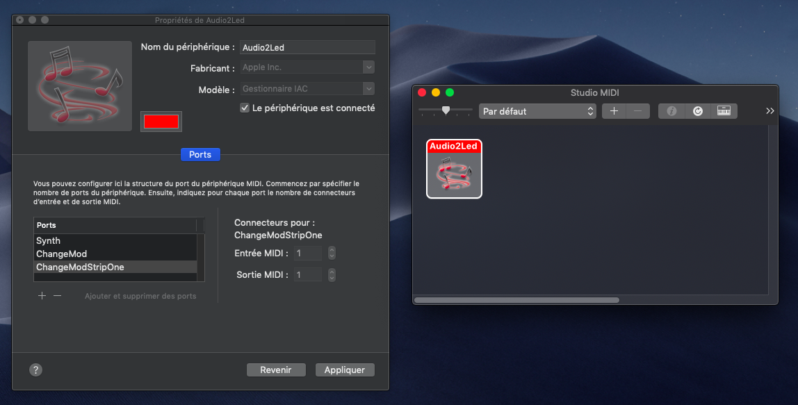
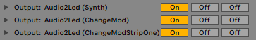

## CONFIG.yml

You can validate the config file with

```
./music2led --text-config-file
```

### Sample config file

```yml

---  # document start

# Desired framerate

fps: 60

# Tell to electron to display the GUI or not

display_interface: false

# Audio ports
# List of used audio ports
# Can be listed with listAvailableDevices.sh
# Can be changed with "Change audio channel"

audio_ports:
  -
    name: Built-in Microphone
    min_frequency: 200
    max_frequency: 12000
    sampling_rate: 44000
    number_of_audio_samples: 24
    min_volume_threshold: 1e-7
    n_rolling_history: 4

# Strips
# They represents independant Arduino cases

strips:
  -

    # Name of the strip
    # Only used in the GUI

    name: Led strip name

    # Name of the associated serial port
    # Can be listed with listAvailableDevices.sh

    serial_port_name: /dev/tty.usbserial-14210

    # Maximum allowed brightness
    # Can be used to limit the power consumption
    # Check the Arduino part readme for more informations about it

    max_brightness: 255

    # Midi channels
    # Can be listed with listAvailableDevices.sh
    # associated_midi_channels : used for midi based visualizers
    # midi_ports_for_changing_mode : used for live changing modes

    associated_midi_channels:
      - Audio2Led Synth
    midi_ports_for_changing_mode:
      - Audio2Led ChangeMod

    # Reverse and mirror mods

    is_reverse: false
    is_mirror: false

    # Time interval value that is used in time based visualizers

    time_interval: 120

    # Chunk size used in alternate colors

    chunk_size: 5

    # Shapes
    # Real shape : represents the physical shape of the strip
    # Shapes : represents virtual shapes
    # Be sure that both of them not contains odd numbers,
    # it may cause crash

    real_shape:
      - 252
    shapes:
      -
        - 126
        - 126
      -
        - 62
        - 62
        - 62
        - 62

    # Available color schemes
    # Can be changed via "Change color scheme"
    # True colors names are available
    # check the file python-app/helpers/color/colorSchemeFormatter.py
    # for the complete list

    color_schemes:
      # pink blue
      -
        - "#FF00C8"
        - "#00EDFF"
      # orange blue
      -
        - "#FFA200"
        - "#00C6FF"
      # red green
      -
        - "#FF002E"
        - "#00FFA4"
      # purple green
      -
        - "#F900FF"
        - "#22FF00"
      # blue yellow
      -
        - "#0024FF"
        - "#FFE500"
      -
        - red
        - green
        - blue
      -
        - red
      -
        - green
      -
        - blue
      -
        - white

    # Default parameters for various stuff
    # Be sure that you are not attempting to access to an index that not
    # exists, it may cause crash

    active_visualizer_mode: 0
    active_audio_channel_index: 0
    active_shape_index: 0
    active_color_index: 0
    active_color_scheme_index: 0
    active_visualizer_effect: scroll

...  # document end

```


# Effects & Modes

Music To Led has 16 visualization effects and 8 mods.

They can be live changed via dedicated Midi channels. You can choose to use programs like Ableton Live to automate these changes or use a dedicated synthetiser / pad to change them manually during the show.

**Principle** You have to send a midi note signal for activating / modifying effects. The table just after will show you the documentation.

## Effects

There is four kind of effects. All the examples are based on a ["red", "green", "blue"] color scheme

### Sound based

| *Number* | *Midi Note* | *Effect name* | *Params* | *Example*
|:--|:--|:--|:--|:--
| 0 | C-2 | **Scroll** | - | 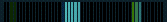
| 1 | C#-2 | **Energy** | - | 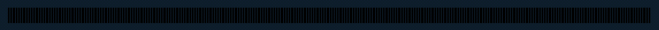
| 2 | D-2 | **Intensity** | - | 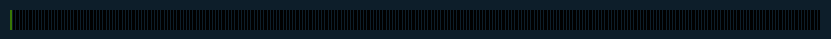
| 3 | D#-2 | **Spectrum** | - | 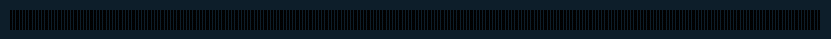

### Midi based

| *Number* | *Midi Note* | *Effect name* | *Params* | *Example*
|:--|:--|:--|:--|:--
| 5 | F-2   | **Piano** | - | 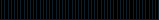
| 6 | F#-2  | **Piano2** | - | TO ADD
| 7 | G-2   | **Envelope** | Color intensity based on pitch bend | 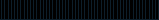
| 8 | G#-2  | - | - | 

### Time based

| *Number* | *Midi Note* | *Effect name* | *Params* | *Example*
|:--|:--|:--|:--|:--
| 10 | A#-2   | **AlternateColors** | Chunk size based on velocity | 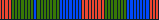
| 11 | B-2    | **AlternateColorsForStrips** | - | 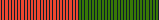
| 12 | C-1    | - | - | 
| 13 | C#-1   | - | - | 

### Generic

| *Number* | *Midi Note* | *Effect name* | *Params* | *Example*
|:--|:--|:--|:--|:--
| 15 | D#-1  | **Full** | - | 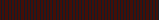
| 16 | E-1   | **FadeToNothing** | - | 
| 17 | F-1  | **Clear** | - | 
| 18 | F#-1  | **Fire** | - | 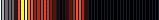

## Modes

| *Number* | *Midi Note* | *Mode name* | *Params* | *Example*
|:--|:--|:--|:--|:--
| 20 | G#-1  | **Toggle reverse mode** | - | 
| 21 | A-1  | **Toggle mirror mode** | - | 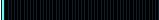
| 22 | A#-1 | **Change shape** | Update based on velocity | 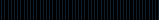
| 23 | B-1 | **Change color scheme** | Update based on velocity | 
| 24 | C-0  | **Change time interval in ms** | Update based on velocity | 
| 25 | C#-0  | **Change audio channel** | Update based on velocity | 
| 26 | D-0 | **Change max Brightness** | Update based on velocity | 
| 27 | D#-0 | **Change chunk size** | Update based on velocity | 


# Credits
This project was a fork of the great [audio-reactive-led-strip](https://github.com/scottlawsonbc/audio-reactive-led-strip). A lot of code has been rewritten since the beginning but it still remains some of the visualizers and audio processing code.

# Contribute
If you have any idea to improve this project or any problem using this, please feel free to upload an [issue](https://github.com/tfrere/music-to-led/issues).

# License
This project was developed by Thibaud FRERE and is released
under the MIT License.
