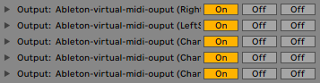

# Audio Reactive LED Strip
Real-time LED strip music visualization using Python and Arduino via serial communication.
This program is linked with Ableton live midi outputs to change visualizations mods

## TO DO
- App OSX package
- Visualization effect mixer
- More control for Ableton Live
- Finish debug shell and audio interfaces

# Arduino


## Electornic parts

- 1x [Alim](https://www.amazon.fr/gp/product/B06XCMQ212/ref=ppx_yo_dt_b_asin_title_o00_s00?ie=UTF8&psc=1)
- 1x Arduino nano ( not a clone )
- 1x 1000mu Capacitor
- 1x [Led strip connector](https://www.amazon.fr/BTF-LIGHTING-Connectors-WS2812B-WS2811-20pairs/dp/B01DC0KIT2/ref=sr_1_19?__mk_fr_FR=ÅMÅŽÕÑ&keywords=led+strip+connector&qid=1569857203&s=lighting&sr=1-19)
- 1x Led strip WS2812B


## Led number limitation

For the moment, the protocol is limited to 254 leds by physical case
and you have to use a even number of leds

## Calculating led power consumtion
Each individual NeoPixel draws up to 60 milliamps at maximum brightness white (red + green + blue).

60 NeoPixels × 60 mA ÷ 1,000 = 3.6 Amps minimum
135 NeoPixels × 60 mA ÷ 1,000 = 8.1 Amps minimum
135 NeoPixels × 60 mA ÷ 1,000 / 2 (for each led to 125,125,125) = 4.05 Amps minimum

300 NeoPixels × 60 mA ÷ 1,000 = 18 Amps minimum
300 NeoPixels × 60 mA ÷ 1,000 / 2 (for each led to 125,125,125) = 9 Amps minimum

# Computer

## Python program
Visualization code is compatible with Python 3.7. A few Python dependencies must also be installed:

### Installing dependencies with Anaconda
Install dependencies using pip and the conda package manager
```
conda install numpy scipy pyqtgraph colour psutil python-rtmidi
pip install pyaudio
```

## Ableton live

### Midi channel configuration




### Midi signals -- Not implemented yet

Notes are clamped between -36 to 91 and gives us 127 possibilities
Velocities are campled between 1 and 127 and gives us also 127 possibilities

- Effects are in a range of 0 to 50
- Mods are in a range of 50 to 100
- Bpms are in a range of 100 to 110 and are using velocity

Example :
For a bpm of 150 you have to send the node 101 with 32 velocity ( 127 + 32 )
For a bpm of 280 you have to send the node 102 with 50 velocity ( 127 + 127 + 24 )


# License
This project was developed by Thibaud FRERE and is released under the MIT License.
