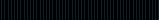

A professionnal live light setup for less than 100 $.
Real-time LED strip music and midi visualization using Python and Arduino via serial communication.

# How it works ?

It takes multiple audio and midi inputs, use them to make awesome visualizations effects and output the result in multiple led strips via a serial protocol.
You can use a MIDI port to send visualization mod change instruction.

- Multiple color schemes
- Multiple virtual strip shapes
- Revese and mirror mods
- 8 Vizualization effects
- Live mods change using dedicated MIDI channels


- [Effects & Mods](#features)
  * [Effects](#effects)
    + [Sound based](#sound-based)
    + [Midi based](#midi-based)
    + [BPM based](#bpm-based)
    + [Generic](#generic)
  * [Mods](#mods)
- [Configuration](#configuration)
  * [Audio channels](#audio-channels)
  * [Midi channels](#midi-channels)
  * [CONFIG.yml](#configyml)
- [Install](#install)
  * [Python program](#python-program)
  * [Arduino part](#arduino-part)
    + [Component list](#component-list)
    + [Electronic scheme](#electronic-scheme)
    + [3d printed case](#3d-printed-case)
    + [Led number limitation](#led-number-limitation)
- [Links](#links)
- [License](#license)

# Effects & Mods

## Effects

### Sound based

| *Number* | *Midi Note* | *Effect name* | *Params* | *Example*
|:--|:--|:--|:--|:--
| 0 | C-0 | **Scroll** | - | 
| 1 | C#-2 | **Energy** | - | 
| 2 | D-2 | **Intensity** | - | 
| 3 | D#-2 | **Spectrum** | - | 

### Midi based

| *Number* | *Midi Note* | *Effect name* | *Params* | *Example*
|:--|:--|:--|:--|:--
| 5 | F-2   | **Piano** | - | 
| 6 | F#-2  | **Envelope** | Color intensity based on pitch bend | 
| 7 | G-2   | - | - | 
| 8 | G#-2  | - | - | 

### BPM based

| *Number* | *Midi Note* | *Effect name* | *Params* | *Example*
|:--|:--|:--|:--|:--
| 10 | A#-2   | **AlternateColors** | Chunk size based on velocity | 
| 11 | B-2    | **AlternateColorsFull** | - | 
| 12 | C-1    | **AlternateColorsForStrips** | - | 
| 13 | C#-1   | - | - | 

### Generic

| *Number* | *Midi Note* | *Effect name* | *Params* | *Example*
|:--|:--|:--|:--|:--
| 15 | D#-1  | **Full** | - | 
| 16 | E-1   | **Nothing** | - | 
| 17 | F-1  | **Fire** | - | 
| 18 | F#-1  | - | - | 

## Mods

| *Number* | *Midi Note* | *Effect name* | *Params* | *Example*
|:--|:--|:--|:--|:--
| 20 | G#-1  | **Reverse mode** | - | 
| 21 | A-1  | **Mirror mode** | - | 
| 22 | A#-1 | **Shapes** | Size based on velocity | 
| 23 | B-1 | **Color schemes** | Size based on velocity | 
| 24 | C-0  | **Bpm** | Size based on velocity | 
| 25 | C#-0  | **Audio channel** | Size based on velocity | 
| 26 | D-0 | **Reset Frame** | - | 
| 27 | D#-0 | - | - | 


# Configuration

## Audio channels

...

## Midi channels


### Ableton live


...

## CONFIG.yml

    ---  # document start

    fps: 60

    display_shell_interface: false
    display_audio_interface: false

    n_rolling_history: 4
    number_of_audio_samples: 24

    audio_ports:
      -
        name: Built-in Microphone
        min_frequency: 200
        max_frequency: 12000
        sampling_rate: 44000
        number_of_audio_samples: 24
        min_volume_threshold: 1e-7

    strips:
      -
        name: Led Strip
        serial_port_name: /dev/tty.usbserial-14210
        max_brightness: 120
        associated_midi_channels:
          - Audio2Led Synth
        midi_ports_for_changing_mode:
          - Audio2Led ChangeMod
        is_reverse: false
        is_mirror: true
        bpm: 120

        # Be sure that real_shape and shapes only contains even numbers
        # It may cause crash if it's not the case

        real_shape:
          - 252
        shapes:
          -
            - 126
            - 126
          -
            - 62
            - 62
            - 62
            - 62

        color_schemes:
          # pink blue
          -
            - "#FF00C8"
            - "#00EDFF"
          # orange blue
          -
            - "#FFA200"
            - "#00C6FF"
          # red green
          -
            - "#FF002E"
            - "#00FFA4"
          # purple green
          -
            - "#F900FF"
            - "#22FF00"
          # blue yellow
          -
            - "#0024FF"
            - "#FFE500"
          -
            - red
            - green
            - blue
          -
            - red
          -
            - green
          -
            - blue
          -
            - white

        active_audio_channel_index: 0
        active_shape_index: 0
        active_color_index: 0
        active_color_scheme_index: 0
        active_visualizer_effect: scroll

    ...  # document end


# Install

## Python program
Code is compatible with Python 3.7. Install dependencies using pip and the conda package manager.

```
pip install -r requirements.txt
conda install --file requirements.txt
```

## Arduino part

You can find 3d models of the cases, the arduino code and all the instructions you need to setup the project. [Arduino part](/arduino/).

### Electronic scheme


### Component list

- 1x [Alim 5V 10A  -  ~25$](https://www.amazon.fr/gp/product/B06XCMQ212/ref=ppx_yo_dt_b_asin_title_o00_s00?ie=UTF8&psc=1)
- 1x Arduino nano or other   -  ~5$
- 1x 1000mu Capacitor   -  ~1$
- 1x [Led strip female connector  -  ~5$](https://www.amazon.fr/BTF-LIGHTING-Connectors-WS2812B-WS2811-20pairs/dp/B01DC0KIT2/ref=sr_1_19?__mk_fr_FR=ÅMÅŽÕÑ&keywords=led+strip+connector&qid=1569857203&s=lighting&sr=1-19)
- 1x Led strip WS2812B -  ~35$

Estimated cost : ~100$

### 3d printed case


### Led number limitation

It depends on two factors :
 - Your board maximum baud rate
 - Your led alimentation

For now, consider not using more than 254 leds.

<!-- # Links
- [Wikipedia DMX](https://fr.wikipedia.org/wiki/DMX_(%C3%A9clairage) -->

<!--

  TO DO BEFORE RELEASE

  - Package app electron and python
  -

 -->


# License
This project was developed by Thibaud FRERE and is released
under the MIT License.
