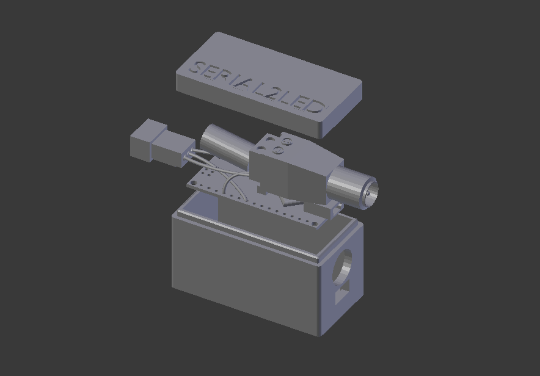
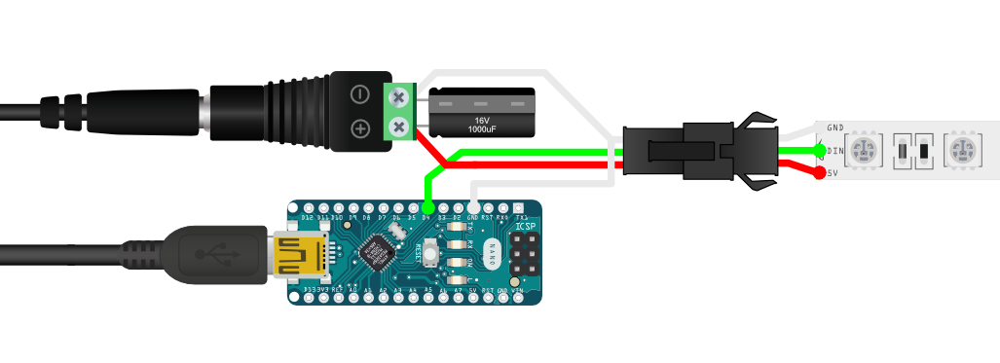

# Arduino

## Electornic parts

- 1x [Alim](https://www.amazon.fr/gp/product/B06XCMQ212/ref=ppx_yo_dt_b_asin_title_o00_s00?ie=UTF8&psc=1)
- 1x Arduino nano ( not a clone )
- 1x 1000mu Capacitor
- 1x [Led strip connector](https://www.amazon.fr/BTF-LIGHTING-Connectors-WS2812B-WS2811-20pairs/dp/B01DC0KIT2/ref=sr_1_19?__mk_fr_FR=ÅMÅŽÕÑ&keywords=led+strip+connector&qid=1569857203&s=lighting&sr=1-19)
- 1x Led strip WS2812B

## Led number limitation

It depends on two factors :

Your board maximum baud rate
Your led alimentation
For now, consider not using more than 254 leds.

## Calculating led power consumtion
Each individual NeoPixel draws up to 60 milliamps at maximum brightness white (red + green + blue).

- 60 NeoPixels × 60 mA ÷ 1,000 = 3.6 Amps minimum
- 135 NeoPixels × 60 mA ÷ 1,000 = 8.1 Amps minimum
- 135 NeoPixels × 60 mA ÷ 1,000 / 2 (for each led to 125,125,125) = 4.05 Amps minimum
- 300 NeoPixels × 60 mA ÷ 1,000 = 18 Amps minimum
- 300 NeoPixels × 60 mA ÷ 1,000 / 2 (for each led to 125,125,125) = 9 Amps minimum
